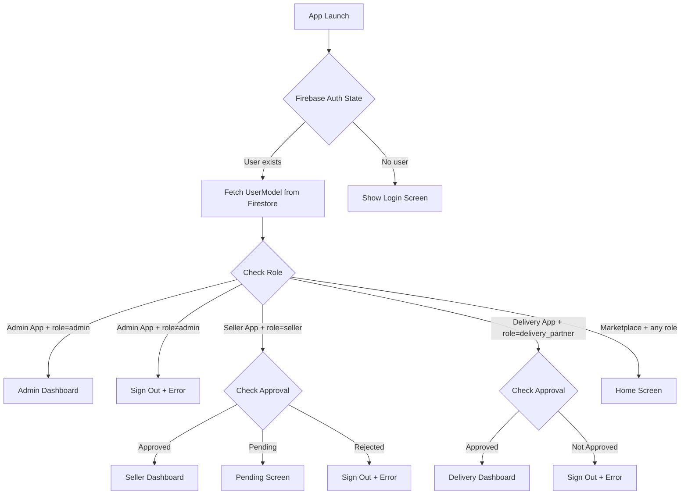

# AGRIMORE PLATFORM — COMPLETE TECHNICAL AUDIT
## Part 1: Executive Summary, Architecture & Feature Extraction

**Document Version:** 1.0  
**Date:** 2026-04-30  
**Auditor:** Senior Architecture & QA Analysis  
**Platform:** Agrimore Multi-Vendor Agriculture E-Commerce

---

## 1. EXECUTIVE SUMMARY

Agrimore is a **multi-vendor agriculture e-commerce platform** built as a Flutter monorepo with Firebase backend. It consists of **5 applications** (Marketplace/Customer, Admin, Seller, Delivery, Marketplace-Web), **3 shared packages** (agrimore_core, agrimore_services, agrimore_ui), and **Firebase Cloud Functions** for backend logic.

### Key Findings

| Metric | Count |
|---|---|
| Total Applications | 5 (4 active Flutter apps + 1 web variant) |
| Shared Packages | 3 (core, services, UI) |
| Cloud Functions | 9 exported functions |
| Data Models | 30 models |
| Firestore Collections | 25+ collections |
| Total Providers (State) | 20 (marketplace) + 17 (admin) + 2 (seller) + 3 (delivery) |
| Total Routes | 55+ (marketplace) + 25+ (admin) |
| Critical Issues | 8 |
| Major Issues | 14 |
| Minor Issues | 11 |

### Overall Health Score: **68/100** ⚠️

The marketplace (customer) app is the most mature. Admin is well-structured with GoRouter. Seller and Delivery apps are **minimal MVPs** with limited functionality. Security has notable gaps.

---

## 2. ARCHITECTURE OVERVIEW

### 2.1 Monorepo Structure

```
Agrimore-main/
├── apps/
│   ├── marketplace/     # Customer app (Flutter, most complete)
│   ├── admin/           # Admin panel (Flutter, GoRouter, web-first)
│   ├── seller/          # Seller app (Flutter, MVP)
│   ├── delivery/        # Delivery app (Flutter, MVP)
│   └── marketplace-web/ # Web variant (separate build target)
├── packages/
│   ├── agrimore_core/   # Models, constants, utils, error handling
│   ├── agrimore_services/ # Firebase services, auth, DB, payments
│   └── agrimore_ui/     # Shared themes, widgets, responsive utils
├── functions/           # Firebase Cloud Functions (TypeScript)
├── firestore.rules      # Firestore security rules
├── storage.rules        # Storage security rules
└── melos.yaml           # Monorepo management
```

### 2.2 Technology Stack

| Layer | Technology |
|---|---|
| Frontend | Flutter (Dart) with Provider state management |
| Backend | Firebase (Firestore, Auth, Storage, Functions, FCM) |
| Routing | Named routes (Marketplace), GoRouter (Admin) |
| Payment | Razorpay (via Cloud Functions) |
| AI | Gemini AI Chat integration |
| Auth | Email/Password + Google OAuth |
| Notifications | FCM + Local notifications |
| Monorepo | Melos |

### 2.3 Role System

| Role | Value in DB | Apps |
|---|---|---|
| Customer/User | `user` | Marketplace |
| Seller | `seller` | Marketplace (limited), Seller App |
| Admin | `admin` | Admin App |
| Delivery Partner | `delivery_partner` | Delivery App |
| Moderator | `moderator` | Defined in model, **no app** |

---

## 3. COMPLETE FEATURE EXTRACTION

### 3.1 Authentication Module

| Feature | Status | Location | Notes |
|---|---|---|---|
| Email/Password Registration | ✅ | Marketplace, Admin | Full validation, rate limiting |
| Email/Password Login | ✅ | All 4 apps | Working with error handling |
| Google OAuth Login | ✅ | Marketplace, Admin | Web popup + mobile native |
| Password Reset | ✅ | Marketplace, Admin | Firebase email reset |
| Change Password | ✅ | Marketplace, Admin | Re-auth required |
| Remember Me | ✅ | Marketplace, Admin | SharedPreferences |
| Rate Limiting (Lockout) | ✅ | Marketplace, Admin | 5 attempts → 15 min lockout |
| Auth Logging | ✅ | Marketplace, Admin | Firestore `auth_logs` |
| Session Persistence | ✅ | Marketplace, Admin | LOCAL persistence for web |
| Role-Based Access Control | ✅ | All apps | Strict role checks |
| Account Deletion | ✅ | Marketplace, Admin | Firestore + Auth cleanup |
| Profile Completion Flow | ✅ | Marketplace | Multi-step onboarding |
| Seller Registration | ⚠️ | Seller App | Login only, no self-registration |
| Delivery Registration | ⚠️ | Delivery App | Login only, admin creates accounts |
| Email OTP Verification | ⚠️ | Cloud Functions | Functions exist, **no UI integration** |
| Phone Auth (OTP) | 🚫 | — | Model supports phone, no implementation |

### 3.2 Marketplace (Customer) Features

#### Home & Discovery

| Feature | Status | Location | Notes |
|---|---|---|---|
| Home Screen (Mobile) | ✅ | `mobile_home_screen.dart` | Banners, categories, featured products |
| Home Screen (Web) | ✅ | `web_home_screen.dart` | Responsive web layout |
| Category Browsing | ✅ | `categories/` | Grid view with icons |
| Product Search | ⚠️ | `search/` | Requires `name_search` field; has fallback |
| Search Results | ✅ | `search_results_screen.dart` | Filtering by query |
| Featured Products | ✅ | Provider-driven | `isFeatured` flag filter |
| Bestseller Sections | ✅ | `BestsellerProvider` | Admin-managed slots |
| Category Sections | ✅ | `CategorySectionProvider` | Admin-curated sections |
| Banner Carousel | ✅ | `BannerProvider` | Home page banners |
| Section Banners | ✅ | `SectionBannerProvider` | Category section banners |
| Sponsored Banners | ✅ | Admin-managed | Seller promotional content |
| Flash Sales | ✅ | `flash_sale/` | Flash sale screen exists |
| Offers Page | ✅ | `offers/` | Dedicated offers screen |
| Landing Page (Web) | ✅ | `landing/` | SEO-friendly web landing |
| Onboarding | ✅ | `onboarding/` | First-time user walkthrough |
| 404 Page | ✅ | `not_found_screen.dart` | Advanced animated 404 |

#### Product Management (Customer View)

| Feature | Status | Location | Notes |
|---|---|---|---|
| Product Detail Page | ✅ | `product_details_screen.dart` | Images, variants, specs |
| Product Variants | ✅ | `ProductVariant` model | Color, size, weight variants |
| Product Reviews | ✅ | `ReviewProvider` | Read/write reviews |
| Product Rating | ✅ | `rating_widget.dart` | Star-based ratings |
| Wishlist | ✅ | `WishlistProvider` | Add/remove, persistent |
| Recently Viewed | ⚠️ | Route defined | Route exists, screen may be incomplete |
| Deep Linking | ✅ | `routes.dart` | `/product/:id`, `/category/:id` |
| Product Sharing | ⚠️ | URL generation | URLs generated, share UI unclear |

#### Cart & Checkout

| Feature | Status | Location | Notes |
|---|---|---|---|
| Shopping Cart | ✅ | `CartProvider` | Real-time Firestore sync |
| Cart Item Quantity | ✅ | `CartItemModel` | Min/max quantity support |
| Coupon Application | ✅ | `CouponProvider` | Code validation, discount calc |
| Coupon Selection Screen | ✅ | `coupon_selection_screen.dart` | Browse available coupons |
| Checkout Flow | ✅ | `checkout_screen.dart` | Multi-step checkout |
| Address Selection | ✅ | `AddressProvider` | Saved addresses |
| Add New Address | ✅ | `add_address_screen.dart` | Form with validation |
| Payment Method Selection | ✅ | `payment_method_screen.dart` | COD + Razorpay |
| Razorpay Integration | ✅ | `PaymentService` | Cloud Function-backed |
| Order Success | ✅ | `order_success_screen.dart` | Confirmation screen |
| Cart Splitting (Multi-vendor) | ✅ | Cloud Function | `splitCartIntoOrders` |

#### Order Management (Customer)

| Feature | Status | Location | Notes |
|---|---|---|---|
| My Orders List | ✅ | `orders_screen.dart` (43KB) | Full order list with filters |
| Order Details | ✅ | `order_details_screen.dart` (91KB) | Comprehensive detail view |
| Order Tracking | ✅ | `order_tracking_screen.dart` | Timeline-based tracking |
| Live Order Tracking | ⚠️ | `live_tracking_screen.dart` | UI exists, needs delivery app integration |
| Track Order (Map) | ⚠️ | `track_order_screen.dart` | Map-based tracking screen |
| Rate Order | ✅ | `rate_order_screen.dart` | Post-delivery rating |
| Order History | ✅ | `order_history_screen.dart` | Past orders |

#### Wallet & Payments

| Feature | Status | Location | Notes |
|---|---|---|---|
| Wallet Dashboard | ✅ | `wallet_screen.dart` | Balance, quick actions |
| Add Money | ✅ | `add_money_screen.dart` | Razorpay top-up |
| Transaction History | ✅ | `transaction_history_screen.dart` | All wallet transactions |
| Referral System | ✅ | `referral_screen.dart` (24KB) | Code sharing, rewards |
| Wallet Provider | ✅ | `wallet_provider.dart` (15KB) | Full wallet logic |

#### Profile & Settings

| Feature | Status | Location | Notes |
|---|---|---|---|
| Profile Screen | ✅ | `profile_screen.dart` | User info display |
| Edit Profile | ✅ | `edit_profile_screen.dart` | Name, phone, photo |
| Change Password | ✅ | `change_password_screen.dart` | Re-auth required |
| Saved Addresses | ✅ | `saved_addresses_screen.dart` | CRUD addresses |
| Settings | ✅ | `settings_screen.dart` | App preferences |
| Theme Toggle | ✅ | `ThemeProvider` | Light/dark mode |
| Language Settings | ✅ | `language_screen.dart` | Language selection |
| Notifications | ✅ | `notifications_screen.dart` | Notification center |
| Rewards | ✅ | `rewards_screen.dart` | Loyalty/rewards |

#### Communication

| Feature | Status | Location | Notes |
|---|---|---|---|
| AI Chat (Gemini) | ✅ | `ai_chat_screen.dart` | AI-powered assistant |
| Chat History | ✅ | `chat_history_screen.dart` | Previous conversations |
| Customer-Seller Chat | ⚠️ | Firestore rules exist | Rules for `threads` collection, **UI unclear** |

#### Seller Features (in Marketplace)

| Feature | Status | Location | Notes |
|---|---|---|---|
| Seller Application | ✅ | `seller_apply_screen.dart` (17KB) | Apply to become seller |
| Seller Dashboard | ✅ | `seller_dashboard_screen.dart` (18KB) | Basic seller stats |
| Seller Panel | ✅ | `seller_panel_screen.dart` (28KB) | Product/order management |

#### Subscriptions

| Feature | Status | Location | Notes |
|---|---|---|---|
| My Subscriptions | ✅ | `my_subscriptions_screen.dart` | View active subscriptions |
| Subscription Setup | ✅ | `subscription_setup_screen.dart` | Create auto-delivery |

#### Legal

| Feature | Status | Location | Notes |
|---|---|---|---|
| Terms & Conditions | ✅ | `terms_screen.dart` | Legal page |
| Privacy Policy | ✅ | `privacy_policy_screen.dart` | Legal page |

### 3.3 Admin Panel Features

| Feature | Status | Location | Notes |
|---|---|---|---|
| Admin Dashboard | ✅ | `admin_dashboard.dart` (35KB) | KPIs, charts, stats |
| Admin Shell (Sidebar) | ✅ | `admin_shell.dart` (22KB) | Navigation sidebar |
| Product Management | ✅ | `products/` | CRUD, form, list |
| Product Form (Add/Edit) | ✅ | `product_form_screen.dart` | Full-screen editor |
| Order Management | ✅ | `orders/` | View, status updates |
| User Management | ✅ | `users/` | View, manage users |
| Delivery Partner Mgmt | ✅ | `delivery/` | Approve/manage partners |
| Coupon Management | ✅ | `coupon/` | CRUD coupons |
| Banner Management | ✅ | `banners/` | Home page banners |
| Sponsored Banners | ✅ | `sponsored_banners/` | Seller ads |
| Section Banners | ✅ | `section_banners/` | Category banners |
| Bestseller Management | ✅ | `bestsellers/` | Curate bestseller slots |
| Category Sections | ✅ | `category_sections/` | Home page sections |
| Notifications (Send) | ✅ | `notifications/` | Broadcast & targeted |
| Analytics Dashboard | ✅ | `analytics/` | Business analytics |
| Admin Settings | ✅ | `settings/` | Platform config |
| Delivery Time Slots | ✅ | `settings/` | Manage delivery windows |
| Seller Requests | ✅ | `sellers/` | Approve/reject sellers |
| Add Seller (Direct) | ✅ | `sellers/` | Admin creates seller |
| Vendor Management | ✅ | `vendors/` | Supplier management |
| Subscription Management | ✅ | `subscriptions/` | Manage subscriptions |
| Rewards Management | ✅ | `rewards/` | Configure rewards |
| Review Management | ✅ | `reviews/` | Moderate reviews |
| Seller Panel (in Admin) | ✅ | `seller/` | Seller view within admin |
| GoRouter Navigation | ✅ | `app_router.dart` | Clean URL-based routing |
| Role-based Redirect | ✅ | Router redirect | Non-admins blocked |
| Wallet Config | ✅ | `WalletConfigProvider` | Configure wallet settings |
| Theme Toggle | ✅ | `ThemeProvider` | Dark/light mode |

### 3.4 Seller App Features

| Feature | Status | Location | Notes |
|---|---|---|---|
| Seller Login | ✅ | `login_screen.dart` | Email/password |
| Seller Registration | ✅ | `seller_registration_screen.dart` | Self-registration form |
| Partner Registration | ✅ | `partner_registration_screen.dart` | Extended registration |
| Pending Approval | ✅ | `pending_approval_screen.dart` | Waiting screen |
| Dashboard | ⚠️ | `dashboard_screen.dart` (14KB) | Basic stats, limited |
| Add Product | ⚠️ | `add_product_screen.dart` (10KB) | Basic product form |
| Order Management | 🚫 | — | **No seller order screen** |
| Earnings/Revenue | 🚫 | — | **Not implemented** |
| Profile Management | 🚫 | — | **Not implemented** |
| Inventory Management | 🚫 | — | **Not implemented** |
| Analytics | 🚫 | — | **Not implemented** |
| Chat with Customers | 🚫 | — | **Not implemented** |

### 3.5 Delivery App Features

| Feature | Status | Location | Notes |
|---|---|---|---|
| Delivery Login | ✅ | `login_screen.dart` | Email/password |
| Partner Registration | ✅ | `partner_registration_screen.dart` | Self-registration |
| Pending Approval | ✅ | `pending_approval_screen.dart` | Waiting screen |
| Dashboard | ⚠️ | `dashboard_screen.dart` (26KB) | Order queue, basic stats |
| Order Management | ⚠️ | `orders/` | Accept/complete orders |
| Location Tracking | ⚠️ | `LocationProvider` | GPS tracking provider |
| Earnings | 🚫 | — | **Not implemented** |
| Route Navigation | 🚫 | — | **Not implemented** |
| Delivery History | 🚫 | — | **Not implemented** |
| Profile Management | 🚫 | — | **Not implemented** |

---

## 4. CLOUD FUNCTIONS

| Function | Type | Status | Description |
|---|---|---|---|
| `sendEmailOTP` | Callable | ✅ | Email OTP generation |
| `verifyEmailOTP` | Callable | ✅ | OTP verification |
| `cleanupInvalidTokens` | Scheduled | ✅ | FCM token cleanup |
| `sendBroadcastNotification` | Callable | ✅ | Mass notifications |
| `sendNotificationToUser` | Callable | ✅ | Targeted notification |
| `sendOrderUpdateNotification` | Callable | ✅ | Order status change alerts |
| `getNotificationStats` | Callable | ✅ | Notification analytics |
| `onOrderStatusChanged` | Trigger | ✅ | Auto-notify on status change |
| `createSellerByAdmin` | Callable | ✅ | Admin creates seller account |
| `createRazorpayOrder` | Callable | ✅ | Secure payment order creation |
| `verifyRazorpayPayment` | Callable | ✅ | Payment signature verification |
| `splitCartIntoOrders` | Callable | ✅ | Multi-vendor cart splitting |

---

## 5. DATA MODELS (30 Total)

| Model | File Size | Key Fields |
|---|---|---|
| UserModel | 7.4KB | uid, email, name, role, phone, photoUrl |
| ProductModel | 15.1KB | name, salePrice, variants, sellerId, location |
| OrderModel | 14KB | userId, items, deliveryAddress, status, tracking |
| CartModel / CartItemModel | 5.8KB / 5.7KB | items, quantities, variants |
| CategoryModel | 5.3KB | name, icon, displayOrder |
| AddressModel | 9.2KB | full address, lat/lng, isDefault |
| CouponModel | 8.7KB | code, discount, validity |
| ReviewModel | 7.2KB | rating, text, userId, productId |
| BannerModel | 3.4KB | image, link, position |
| WalletModel | 6KB | balance, transactions |
| WalletTransactionModel | 6.4KB | amount, type, timestamp |
| WalletConfigModel | 6.8KB | referral rewards config |
| DeliveryPartnerModel | 7.3KB | status, location, vehicle |
| NotificationModel | 2.7KB | title, body, type |
| OrderTimelineModel | 3.6KB | status history events |
| VendorModel | 2.9KB | supplier info |
| SponsoredBannerModel | 3.2KB | ad campaigns |
| SectionBannerModel | 4.4KB | section-specific banners |
| BestsellerSlotModel | 3.4KB | curated bestseller slots |
| CategorySectionSlotModel | 4.8KB | home page sections |
| ReferralModel | 4.7KB | referral tracking |
| ChatMessage | 6.1KB | chat messages |
| DeliveryTimeSlotModel | 2.5KB | delivery windows |
| PaymentSettingsModel | 2.7KB | payment config |
| IndiaLocations | 19.6KB | State/city data |
| + 5 more utility models | — | UPI, OrderItem, OrderStatus, etc. |
# AGRIMORE PLATFORM — COMPLETE TECHNICAL AUDIT
## Part 2: Error Analysis, Workflows, Security & Architecture

---

## 6. ERROR ANALYSIS

### 6.1 Critical Issues

| # | Issue | Severity | Location | Root Cause | Fix Suggestion |
|---|---|---|---|---|---|
| C1 | **Auth service auto-assigns `admin` role** on missing user doc during email login | 🔴 Critical | `auth_service.dart:158-164` | Recovery logic defaults to `role: 'admin'` when user doc is missing | Change default role to `'user'` — never auto-assign admin |
| C2 | **`auth_logs` collection allows unauthenticated writes** | 🔴 Critical | `firestore.rules:419` | `allow create: if true;` — anyone can write fake auth logs | Change to `allow create: if isAuthenticated();` |
| C3 | **Storage rules too permissive** — any auth user can write anywhere | 🔴 Critical | `storage.rules:24-29` | Global `/{allPaths=**}` with no path-based restrictions | Add path-based rules: `/products/{uid}/`, `/profiles/{uid}/` |
| C4 | **Payment signature verification always returns `true`** | 🔴 Critical | `payment_service.dart:96-108` | `verifyPaymentSignature()` is a stub | Implement server-side verification via Cloud Function |
| C5 | **Wallet transactions allow any authenticated user to create** | 🔴 Critical | `firestore.rules:450` | Duplicate `allow create` rule overrides user-specific check | Remove the overly broad `allow create: if isAuthenticated();` |
| C6 | **User collection has public read** (`allow read: if true`) | 🔴 Critical | `firestore.rules:45` | All user data (email, phone, role) exposed publicly | Restrict to `isAuthenticated()` or field-level security |
| C7 | **Seller app has no order management** | 🔴 Critical | `apps/seller/lib/screens/` | Only auth + dashboard + add product screens exist | Implement order list, order detail, status update screens |
| C8 | **Location-based filtering is fully commented out** | 🔴 Critical | `database_service.dart:49-54` | All location `where` clauses are commented | Uncomment after ensuring products have `location` field |

### 6.2 Major Issues

| # | Issue | Severity | Location | Root Cause | Fix |
|---|---|---|---|---|---|
| M1 | **Search requires `name_search` field** that may not exist | 🟠 Major | `database_service.dart:244` | Products without `name_search` field won't appear | Add Cloud Function to auto-populate `name_search` on write |
| M2 | **Seller app only has 2 providers** | 🟠 Major | `seller/main.dart` | Missing OrderProvider, AnalyticsProvider, etc. | Add comprehensive provider suite |
| M3 | **Delivery app signs out on pending approval** | 🟠 Major | `delivery/auth_provider.dart:57-59` | Auto sign-out prevents re-checking approval | Show pending screen instead of signing out |
| M4 | **No email verification flow** | 🟠 Major | All apps | Users can register without verifying email | Add `sendEmailVerification()` and check `emailVerified` |
| M5 | **Admin admin-allowlist has hardcoded emails** | 🟠 Major | `auth_service.dart:309` | `admin@agrimore.com`, `admin@admin.com` hardcoded | Move to Firestore `settings/access` only |
| M6 | **Marketplace auth provider doesn't check roles** | 🟠 Major | `marketplace/auth_provider.dart` | Any role can access marketplace — admins/sellers too | Add role-based redirection for non-user roles |
| M7 | **`navigateFromUrl` has infinite recursion risk** | 🟠 Major | `routes.dart:678-691` | Lines 678-691 call `navigateFromUrl` recursively | Remove recursive calls, use `navigateTo` instead |
| M8 | **Order number generation is timestamp-based** | 🟠 Major | `order_model.dart:332-334` | `ORD${timestamp.substring(5)}` can collide | Use UUID or Firestore auto-ID + counter |
| M9 | **Delivery verification code is predictable** | 🟠 Major | `order_model.dart:338-340` | Based on `microsecondsSinceEpoch % 900000` | Use `Random.secure()` for cryptographic randomness |
| M10 | **No seller-specific product scoping in seller app** | 🟠 Major | `seller/seller_product_provider.dart` | Only 2.3KB — minimal implementation | Filter products by `sellerId == currentUser.uid` |
| M11 | **Marketplace-web app exists but structure unclear** | 🟠 Major | `apps/marketplace-web/` | Separate directory, may be stale | Consolidate with marketplace app's web support |
| M12 | **No integration tests** | 🟠 Major | `integration_test/` | Directory exists but likely empty/minimal | Add E2E tests for critical flows |
| M13 | **Admin `restoreSession` doesn't enforce admin role** | 🟠 Major | `admin/auth_provider.dart:101-125` | `restoreSession` doesn't check if user is admin | Add role check in `restoreSession` |
| M14 | **No offline support/caching** | 🟠 Major | All apps | No Firestore offline persistence config | Enable Firestore offline persistence |

### 6.3 Minor Issues

| # | Issue | Severity | Location | Root Cause | Fix |
|---|---|---|---|---|---|
| m1 | **Multiple `AuthService` instances** in marketplace | 🟡 Minor | `marketplace/main.dart:76` | Creates new `AuthService()` as Provider alongside singleton | Use singleton consistently |
| m2 | **Unused `_lastAuthCheck` field** | 🟡 Minor | `marketplace/auth_provider.dart:24` | Set but never read | Remove or implement timeout check |
| m3 | **Seller app uses `super.key` on private widgets** | 🟡 Minor | `seller/app.dart:48` | `_SellerSplashWrapper({super.key})` — private, key unused | Remove `super.key` from private widgets |
| m4 | **Debug prints in production code** | 🟡 Minor | Entire codebase | Hundreds of `debugPrint` calls with emoji | Use `kDebugMode` guard or logging framework |
| m5 | **`order_status.dart` import unused** | 🟡 Minor | `database_service.dart:12` | Import present but no symbols used | Remove unused import |
| m6 | **Fallback search fetches ALL products** | 🟡 Minor | `database_service.dart:271` | `_searchProductsFallback` loads entire collection | Add limit or remove fallback |
| m7 | **Melos config has placeholder repo URL** | 🟡 Minor | `melos.yaml:2` | `repository: https://github.com/your-org/agrimore` | Update to actual repository URL |
| m8 | **No loading state for seller splash** | 🟡 Minor | `seller/app.dart:57` | Splash navigates without checking auth readiness | Add auth state check like admin splash |
| m9 | **ThemeProvider in admin is minimal** | 🟡 Minor | `admin/theme_provider.dart` (877B) | Very basic compared to marketplace | Standardize theme handling |
| m10 | **Duplicate `status` and `orderStatus` fields** | 🟡 Minor | `order_model.dart:260-261` | Both written on save for compatibility | Migrate to single field |
| m11 | **No input sanitization** | 🟡 Minor | All forms | User input not sanitized for XSS/injection | Add sanitization utilities |

---

## 7. AUTHENTICATION & ROLE FLOW

### 7.1 Auth Flow Diagram



### 7.2 Role Mismatch Scenarios

| Scenario | Current Behavior | Expected Behavior | Status |
|---|---|---|---|
| Admin logs into Marketplace | ✅ Allowed (treated as user) | Should redirect to Admin app or show admin features | ⚠️ |
| Seller logs into Admin app | ✅ Blocked and signed out | Correct | ✅ |
| User logs into Seller app | ✅ Blocked and signed out | Correct | ✅ |
| User logs into Delivery app | ✅ Blocked and signed out | Correct | ✅ |
| Google login creates `user` role in Admin app | ✅ Blocked post-creation | Should not create user doc first | ⚠️ |
| Missing user doc during email login | ❌ Auto-creates with `admin` role | Should fail gracefully | 🔴 |
| Seller with no `sellers` collection doc | ⚠️ Falls back to `unknown` status | Should show clear error | ⚠️ |

### 7.3 Admin Role Sync Policy

The `_syncRoleWithAdminPolicy` in `auth_service.dart` implements:
1. **Bootstrap admins** — hardcoded in `AdminAccessConfig`
2. **Firestore allowlist** — `settings/access.adminEmails`
3. **Hardcoded emails** — `admin@agrimore.com`, `admin@admin.com`, `agrimore@gmail.com`
4. **Empty allowlist** — preserves existing admin roles

> [!WARNING]
> The hardcoded admin emails (line 309) are a **security risk**. Anyone registering with these emails gets admin access.

---

## 8. APPLICATION WORKFLOWS

### 8.1 Customer Journey

```
1. App Launch → Splash Screen (2-3s)
2. Auth Check → Login/Register OR Home Screen
3. Browse Home → Banners, Categories, Featured, Bestsellers
4. Search/Browse → Category filter, text search
5. Product Details → Images, variants, reviews, specs
6. Add to Cart → Select variant, quantity
7. Cart Review → Apply coupon, view totals
8. Checkout → Select address → Payment method
9. Payment → Razorpay (online) or COD
10. Order Confirmation → Success screen
11. Track Order → Timeline, live tracking (partial)
12. Rate & Review → Post-delivery feedback
13. Wallet → Add money, referrals, transaction history
14. Profile → Edit info, addresses, settings, logout
```

### 8.2 Seller Journey

```
1. App Launch → Splash → Login
2. Authentication → Role check (must be 'seller')
3. Approval Check → Pending screen if not approved
4. Dashboard → Basic stats (limited)
5. Add Product → Name, price, images, category
6. [MISSING] View/Edit Products
7. [MISSING] Order Management
8. [MISSING] Revenue/Earnings
9. [MISSING] Customer Chat
10. Logout
```

### 8.3 Admin Journey

```
1. App Launch → Splash → Auth check
2. Authentication → Strict admin role verification
3. Dashboard → KPIs, revenue, order stats, charts
4. Product Management → Add/Edit/Delete products
5. Order Management → View all, update status
6. User Management → View users, manage roles
7. Seller Requests → Approve/reject applications
8. Delivery Partners → Manage delivery staff
9. Marketing → Banners, sponsored, sections, bestsellers
10. Coupons → Create/manage discount codes
11. Notifications → Send broadcast/targeted
12. Analytics → Business intelligence
13. Settings → Platform configuration
14. Logout
```

### 8.4 Delivery Partner Journey

```
1. App Launch → Splash → Login
2. Authentication → Role check (delivery_partner)
3. Approval Check → Must be in delivery_partners collection
4. Dashboard → Available orders, active delivery
5. Accept Order → Take assignment
6. [MISSING] Navigation/Maps
7. Update Status → Mark picked up, delivered
8. [MISSING] Earnings tracking
9. [MISSING] Delivery history
10. Logout
```

---

## 9. PAGE & NAVIGATION ANALYSIS

### 9.1 Marketplace Routes (55+ routes)

All routes defined in `routes.dart`. Key findings:
- ✅ All major routes have `AuthGuard` protection
- ✅ Dynamic routes for products (`/product/:id`) and categories
- ✅ Error routes return `NotFoundScreen`
- ⚠️ `/product` without ID redirects to main (may confuse users)
- ⚠️ Deep link handler has recursive call risk (lines 678-691)

### 9.2 Admin Routes (25+ routes via GoRouter)

- ✅ Shell route provides consistent sidebar navigation
- ✅ Full-screen routes (product form) bypass shell
- ✅ Auth redirect prevents unauthorized access
- ✅ Fade transitions for smooth UX

### 9.3 Dead/Broken Navigation Risks

| Route | Status | Issue |
|---|---|---|
| `/recently-viewed` | ⚠️ | Route defined, screen may lack data population |
| `/deals` | ⚠️ | Route defined, `showDeals` param on ShopScreen may not filter |
| `/support` | ⚠️ | Maps to AI Chat — may confuse users expecting human support |
| Seller app — no routes | ❌ | Imperative navigation only, no named routes |
| Delivery app — no routes | ❌ | Imperative navigation only, no named routes |

---

## 10. API & BACKEND VALIDATION

### 10.1 Firestore Collections Status

| Collection | Read | Write | Rules | Status |
|---|---|---|---|---|
| `users` | Public ⚠️ | Owner/Admin | ✅ | Read too permissive |
| `products` | Public ✅ | Admin/Seller ✅ | ✅ | Correct |
| `orders` | Auth ✅ | Auth ✅ | ✅ | Well-scoped |
| `categories` | Public ✅ | Admin ✅ | ✅ | Correct |
| `coupons` | Public ✅ | Admin ✅ | ✅ | Correct |
| `banners` | Public ✅ | Admin ✅ | ✅ | Correct |
| `carts` | Owner ✅ | Owner ✅ | ✅ | Correct |
| `wishlists` | Owner ✅ | Owner ✅ | ✅ | Correct |
| `addresses` | Owner ✅ | Owner ✅ | ✅ | Correct |
| `wallets` | Owner+Auth ⚠️ | Owner ✅ | ⚠️ | Duplicate read rules |
| `wallet_transactions` | Owner ✅ | Auth ⚠️ | ⚠️ | Overly broad create |
| `auth_logs` | Admin ✅ | Anyone ❌ | 🔴 | Unauthenticated create |
| `delivery_partners` | Owner/Admin ✅ | Owner/Admin ✅ | ✅ | Correct |
| `threads` | Participants ✅ | Participants ✅ | ✅ | Well-scoped |
| `referrals` | Auth ✅ | Auth ✅ | ✅ | Correct |

### 10.2 Missing Backend Endpoints

| Feature | Current State | Needed |
|---|---|---|
| Seller order notifications | ❌ Missing | Cloud Function to notify sellers of new orders |
| Delivery partner assignment | ❌ Missing | Auto-assign or notify available partners |
| Inventory management | ❌ Missing | Stock deduction on order, low-stock alerts |
| Revenue/commission calculation | ❌ Missing | Platform fee, seller payout logic |
| Subscription renewal | ❌ Missing | Scheduled function for auto-orders |
| Email verification | ❌ Missing | Verify email before allowing certain actions |

---

## 11. UI/UX ANALYSIS

| Issue | Location | Severity | Notes |
|---|---|---|---|
| Seller app uses inline theme, not shared | `seller/app.dart:19-40` | 🟡 Minor | Should use `agrimore_ui` theme |
| Delivery app uses inline theme | `delivery/app.dart:19-36` | 🟡 Minor | Should use `agrimore_ui` theme |
| Seller app has no bottom navigation | Seller app | 🟠 Major | Only dashboard, no nav structure |
| Delivery app has no bottom navigation | Delivery app | 🟠 Major | Only dashboard, no nav structure |
| Admin app loads placeholder on router init | `admin/app.dart:31-35` | 🟡 Minor | Shows CircularProgressIndicator briefly |
| Order details screen is 91KB | Marketplace | 🟡 Minor | Should be split into sub-components |
| Main screen is 35KB | Marketplace | 🟡 Minor | Heavy single file |
| Web home screen is 42KB | Marketplace | 🟡 Minor | Should be componentized |
| No skeleton loading in seller/delivery | Seller, Delivery | 🟡 Minor | Only basic CircularProgressIndicator |

---

## 12. PERFORMANCE ANALYSIS

| Issue | Impact | Location | Fix |
|---|---|---|---|
| Fallback search loads ALL products | High | `database_service.dart:271` | Add pagination or remove fallback |
| No pagination on product lists | Medium | `database_service.dart:44-83` | Implement cursor-based pagination |
| No image caching strategy | Medium | All apps | Use `cached_network_image` consistently |
| 20 providers in marketplace main | Medium | `marketplace/main.dart` | Lazy-load providers not needed at startup |
| All categories fetched then filtered | Low | `database_service.dart:346-364` | Filter in query, not in memory |
| Deferred services use `Future.microtask` | Low | `marketplace/main.dart:111` | Could use `SchedulerBinding.addPostFrameCallback` |
| No Firestore query result limits | Medium | Multiple queries | Add `.limit()` to all list queries |

---

## 13. SECURITY ANALYSIS

### 13.1 Critical Vulnerabilities

| # | Vulnerability | Risk Level | Details |
|---|---|---|---|
| S1 | **Public user data** | 🔴 High | `users` collection readable by anyone — exposes emails, phones, roles |
| S2 | **Unauthenticated auth_logs writes** | 🔴 High | Attacker can flood `auth_logs` with fake data |
| S3 | **Auto-admin assignment** | 🔴 High | Missing user doc → auto-created with `admin` role |
| S4 | **Hardcoded admin emails** | 🔴 High | Known emails get admin access automatically |
| S5 | **Payment verification stub** | 🔴 High | `verifyPaymentSignature` always returns `true` |
| S6 | **Overly permissive storage rules** | 🟠 Medium | Any authenticated user can upload to any path |
| S7 | **No CORS restrictions on Functions** | 🟠 Medium | Cloud Functions may be callable from any origin |
| S8 | **Predictable delivery codes** | 🟠 Medium | Timestamp-based, easily guessable |
| S9 | **No rate limiting on Cloud Functions** | 🟠 Medium | Functions can be called repeatedly |
| S10 | **`.env` file in repository** | 🟠 Medium | API keys may be committed to git |

### 13.2 Recommendations

1. **Immediately** fix auto-admin assignment (change default role to `'user'`)
2. **Immediately** restrict `auth_logs` to authenticated writes
3. **This week** restrict `users` collection read to authenticated users
4. **This week** implement real payment signature verification
5. **This sprint** add path-based storage security rules
6. **This sprint** remove hardcoded admin emails
7. **Next sprint** add rate limiting to Cloud Functions
8. **Next sprint** implement proper CORS configuration

---

## 14. RECOMMENDED FIX ROADMAP

### Phase 1: Critical Security Fixes (Week 1)

| Priority | Task | Effort |
|---|---|---|
| P0 | Fix auto-admin role assignment in `auth_service.dart:158` | 1 hour |
| P0 | Fix `auth_logs` Firestore rules | 30 min |
| P0 | Restrict `users` collection public read | 30 min |
| P0 | Implement payment signature verification | 4 hours |
| P0 | Fix `wallet_transactions` duplicate create rule | 30 min |
| P0 | Add path-based storage rules | 2 hours |

### Phase 2: Core Feature Completion (Weeks 2-4)

| Priority | Task | Effort |
|---|---|---|
| P1 | Build seller order management screens | 3 days |
| P1 | Build seller product list/edit screens | 2 days |
| P1 | Build seller earnings/revenue screen | 2 days |
| P1 | Build delivery order flow screens | 2 days |
| P1 | Implement location-based product filtering | 1 day |
| P1 | Add email verification flow | 1 day |
| P1 | Fix search `name_search` field population | 1 day |

### Phase 3: Enhancement & Polish (Weeks 5-8)

| Priority | Task | Effort |
|---|---|---|
| P2 | Add seller analytics dashboard | 3 days |
| P2 | Add delivery navigation/maps | 3 days |
| P2 | Implement inventory management | 2 days |
| P2 | Add seller-customer chat UI | 3 days |
| P2 | Implement subscription renewal logic | 2 days |
| P2 | Add proper pagination everywhere | 2 days |
| P2 | Add offline support | 2 days |
| P2 | Standardize themes across all apps | 1 day |

### Phase 4: Production Hardening (Weeks 9-10)

| Priority | Task | Effort |
|---|---|---|
| P3 | Add comprehensive integration tests | 5 days |
| P3 | Implement proper logging framework | 2 days |
| P3 | Add Cloud Function rate limiting | 1 day |
| P3 | Performance optimization & code splitting | 3 days |
| P3 | Add monitoring & alerting | 2 days |

---

## 15. SUGGESTED NEXT-GEN ARCHITECTURE

### 15.1 Improved Module Separation

```
packages/
├── agrimore_core/          # Models, constants (KEEP)
├── agrimore_services/      # Firebase services (KEEP)
├── agrimore_ui/            # Shared UI (KEEP)
├── agrimore_auth/          # NEW: Unified auth module
│   ├── auth_service.dart
│   ├── role_guard.dart
│   └── auth_provider.dart
├── agrimore_payments/      # NEW: Payment module
│   ├── razorpay_service.dart
│   ├── wallet_service.dart
│   └── payment_provider.dart
└── agrimore_notifications/  # NEW: Notification module
    ├── notification_service.dart
    ├── fcm_service.dart
    └── push_handler.dart
```

### 15.2 Key Architecture Improvements

1. **Unified Auth Package** — Single `agrimore_auth` package used by all apps, with role-based guards built in
2. **Repository Pattern** — Add repository layer between providers and services for testability
3. **Bloc/Riverpod Migration** — Consider migrating from Provider for better state isolation
4. **API Abstraction** — Abstract Firebase behind interfaces for future backend migration
5. **Feature Flags** — Add remote config for feature toggles
6. **Modular Routing** — Use GoRouter in all apps (not just admin)
7. **Shared Auth Provider** — Single auth provider in shared package, configured per-app
8. **Event-Driven Architecture** — Use Firestore triggers more extensively for cross-service communication

### 15.3 Recommended Database Improvements

1. **Add composite indexes** for common queries (status + date, category + location)
2. **Denormalize seller info** on products for faster reads
3. **Add `name_search` field** via Cloud Function trigger on product write
4. **Implement soft deletes** instead of hard deletes
5. **Add `updatedBy` audit field** to all admin-managed collections
6. **Shard counters** for high-write fields (view counts, order counts)

---

> [!IMPORTANT]
> **Top 3 Immediate Actions:**
> 1. Fix the auto-admin role assignment security vulnerability
> 2. Complete the Seller app with order management
> 3. Restrict public read access on the `users` collection

---

*End of Agrimore Platform Technical Audit*
